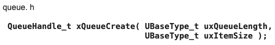

<div align="center"><b>Mục Lục</b></div>

- [A. FreeRTOS](#b-freertos)
  - [I. Kernel](#i-kernel)
  - [II. Task](#ii-task)
    - [1. xTaskCreate()](#1-xtaskcreate)
      - [a. Argument](#a-argument)
        - [**Nhắc lại về con trỏ :**](#nhắc-lại-về-con-trỏ-)
      - [b. Note](#b-note)
      - [c. Return](#c-return)
      - [d. Stack Setting](#d-stack-setting)
    - [2. vTaskDelete()](#2-vtaskdelete)
    - [3. vTaskDelay()](#3-vtaskdelay)
    - [4. vTaskSuspendAll() \& vTaskResumeAll()](#4-vtasksuspendall--vtaskresumeall)
    - [5. vTaskList()](#5-vtasklist)
      - [Kí hiệu :](#kí-hiệu-)
    - [6. uxTaskGetStackHighWaterMark()](#6-uxtaskgetstackhighwatermark)
    - [7. Task Watchdog Timer(API của riêng ESP32)](#7-task-watchdog-timerapi-của-riêng-esp32)
      - [a. Tổng quan](#a-tổng-quan)
      - [b. Task Watchdog Timer (TWDT)](#b-task-watchdog-timer-twdt)
      - [c. Các hàm:](#c-các-hàm)
      - [d. Các dùng:](#d-các-dùng)
      - [Config timeout](#config-timeout)
  - [II. Queue](#ii-queue)
    - [1. QueueCreate()](#1-queuecreate)
    - [2. UBaseType\_t uxQueueMessagesWaiting( QueueHandle\_t xQueue );](#2-ubasetype_t-uxqueuemessageswaiting-queuehandle_t-xqueue-)
    - [3. UBaseType\_t uxQueueMessagesWaitingFromISR( QueueHandle\_t xQueue );](#3-ubasetype_t-uxqueuemessageswaitingfromisr-queuehandle_t-xqueue-)
    - [4. UBaseType\_t uxQueueSpacesAvailable( QueueHandle\_t xQueue );](#4-ubasetype_t-uxqueuespacesavailable-queuehandle_t-xqueue-)
    - [5. vQueueDelete](#5-vqueuedelete)
    - [6. xQueueReset](#6-xqueuereset)
    - [7. xQueueIsQueueEmptyFromISR](#7-xqueueisqueueemptyfromisr)
    - [8. xQueueIsQueueFullFromISR](#8-xqueueisqueuefullfromisr)
    - [9. Một vài ví dụ code từ khoá học](#9-một-vài-ví-dụ-code-từ-khoá-học)
        - [Nhắc lại về Malloc: char *pcStrToSend = (char*)malloc(strMaxLen);](#nhắc-lại-về-malloc-char-pcstrtosend--charmallocstrmaxlen)
  - [III. Queue Set](#iii-queue-set)
    - [1. xQueueCreateSet()](#1-xqueuecreateset)
    - [2. Queue Mailbox](#2-queue-mailbox)
  - [III. Software Timer Management](#iii-software-timer-management)
    - [1. xTimerCreate()](#1-xtimercreate)
    - [2. Hàm callback :](#2-hàm-callback-)
    - [3. xTimerStart() va xTimerStop()](#3-xtimerstart-va-xtimerstop)
    - [4. pcTimerGetName() \& pvTimerGetTimerID()](#4-pctimergetname--pvtimergettimerid)
    - [5. xTimerReset() \& xTimerChangePeriod()](#5-xtimerreset--xtimerchangeperiod)
  - [IV. Semaphore](#iv-semaphore)
    - [1. vSemaphoreCreateBinary()](#1-vsemaphorecreatebinary)
    - [1. vSemaphoreCreateBinary()](#1-vsemaphorecreatebinary-1)
    - [2.](#2)
    - [3. Mutex](#3-mutex)
    - [4. Sự Khác Biệt Giữa Mutex và Semaphore](#4-sự-khác-biệt-giữa-mutex-và-semaphore)
      - [1. Mutex](#1-mutex)
        - [Định nghĩa](#định-nghĩa)
        - [Cách thức hoạt động](#cách-thức-hoạt-động)
        - [Ưu điểm](#ưu-điểm)
        - [Nhược điểm](#nhược-điểm)
      - [2. Semaphore](#2-semaphore)
        - [Định nghĩa](#định-nghĩa-1)
        - [Cách thức hoạt động](#cách-thức-hoạt-động-1)
        - [Ưu điểm](#ưu-điểm-1)
        - [Nhược điểm](#nhược-điểm-1)
    - [V. Recursive Mutex](#v-recursive-mutex)
    - [VI. EventGroup](#vi-eventgroup)
      - [Ví dụ :](#ví-dụ-)
- [Một só khái niệm quan trong](#một-só-khái-niệm-quan-trong)
- [Tài Liệu Tham Khảo](#tài-liệu-tham-khảo)

# A. FreeRTOS

**Lý do sử dụng FreeRTOS**
-   có chế dộ tick-less hô trợ ứng dụng tiết kiệm năng luợng.
-   Chỉ cần 3 têp nguồn chung cho tất cả các cổng RTOS và 1 têp nguồn cho vi đieề khiển, và API thiêt kế đơn giản, trực quan.
-   Tiết kiệm tài nguyên.
## I. Kernel
-   Là hệ điều hành nhúng thời gian thực với Kernel nhỏ gọn, quản lý các tác vụ lập lịch , cung cấp các  tính năng như semphones, mutexes, queues.

## II. Task

### 1. [xTaskCreate()](https://www.freertos.org/fr-content-src/uploads/2018/07/FreeRTOS_Reference_Manual_V10.0.0.pdf#page=34)
-   Mỗi Task dùng RAM đuợc cấp để giữ task state(TCB : the task control block), xTaskCreate thì freeRTOS tự dộng cấp phát từ HEAP, xTaskCreateStatic thì đuợc cấp bơở nguườ dùng. Nên nó câầ thêm 2 tham sô là TCB, bộ nhớ cho stack của task
<div style="text-align:center">
    
</div>

#### a. Argument
1.   pvTaskCode: Đây là con trỏ tới hàm thực thi của task, trỏ đến một hàm C và thường được triển khai như một vòng lặp vô hạn
2.   pcName: Đây là tên mô tả task để gỡ lỗi và theo dõi, giúp bạn xác định các task khi sử dụng các công cụ gỡ lỗi hoặc theo dõi thông tin hệ thống.
3.   usStackDepth: Đây là độ sâu của stack được cấp phát cho task, được đo bằng số lượng từ (hoặc từ đơn vị của kiến trúc cụ thể). Điều này quyết định kích thước của bộ nhớ stack được cấp phát cho task.
4.   pvParameters: Đây là con trỏ tới dữ liệu được chuyển vào task khi nó được tạo. Dữ liệu này thường được sử dụng để truyền các thông số hoặc cấu trúc dữ liệu khác cho task. Nó có kiểu void* để phù hợp với nhiều kiểu dữ liệu, có thể cast(ép kiểu) thành bất cứ kiểu dữ liệu nào trong C
5.   uxPriority: task có ưu tiên cao hơn được lập lịch để thực thi trước các task có ưu tiên thấp hơn.
6.   pxCreatedTask: là con trỏ tới một biến TaskHandle_t để lưu trữ handle của task được tạo. Nếu không cần thiết, đặt giá trị này thành NULL.

```c 
//ví dụ về dùng pvParameters 
void vTaskCode(void *xParameter){
    while(1){
    char *a;
    a = (void*) xParameter;
    printf("%s",a);
    vTaskDelay(100/portTICK_PERIOD_MS);
    }
}
char a = 'x';
void app_main(void)
{   
    while(1){  
    xTaskCreate(vTaskCode, "hello", 2048, &a, 5, NULL);
    }
}
```
#####   **Nhắc lại về con trỏ :**
-   pInt là một biến con trỏ đến int.
-   *pInt là giá trị của int mà pInt trỏ đến.
-   &pInt là địa chỉ của chính biến con trỏ pInt trong bộ nhớ.

=>>> Vậy pInt = (int *)pvParam; tức là biến pInt = giá trị ma con trỏ *pvParam đang trỏ đến, chứ không phải là giá trị của pvRaram

#### b. Note
-   **Con trỏ hàm không cần &, con trỏ tới biến cần &. Nên pvTaskCode không cần &, nhưng pxCreatedTask cần &**
-   **pvParameters là đối số của hàm pvTaskCode, nếu không dùng thì đặt là NULL**
-   configSUPPORT_DYNAMIC_ALLOCATION là một cấu hình trong tệp FreeRTOSConfig.h của FreeRTOS. Khi được đặt thành 1, nó cho phép sử dụng các tính năng yêu cầu cấp phát bộ nhớ động trong FreeRTOS, bao gồm cả việc tạo task bằng hàm xTaskCreate(). Nếu không định nghĩa hoặc đặt configSUPPORT_DYNAMIC_ALLOCATION thành 1, các tính năng này có thể không khả dụng hoặc bị vô hiệu hóa.
#### c. Return
1. pdPASS: được định nghiĩ trong FreeRTOS, value = 1 khi task tạo thành công
2. errCOULD_NOT_ALLOCATE_REQUIRED_MEMORY: trả về khi bộ nhớ heap không đủ cho data structure và stack của task. Nếu sử dụng các file heap_1.c, heap_2.c hoặc heap_4.c trong dự án, tổng lượng bộ nhớ heap có sẵn được xác định bởi configTOTAL_HEAP_SIZE trong file FreeRTOSConfig.h. Lỗi không thể cấp phát bộ nhớ có thể được gỡ lỗi bằng cách sử dụng hàm gọi lại vApplicationMallocFailedHook(), và lượng bộ nhớ heap còn lại có thể được truy vấn bằng cách sử dụng hàm API xPortGetFreeHeapSize(). Nếu bạn sử dụng file heap_3.c trong dự án, tổng kích thước của bộ nhớ heap được xác định bởi cấu hình của trình liên kết.

#### d. Stack Setting
-   usStackDepth: là giá tri chỉ bộ nhớ cấp cho task, đơn vị là "work", là đơn vị dữ liệu cơ bản mà CPU xử lý trong một lần thực hiện, và kích thước của nó phụ thuộc vào kiến trúc của hệ thống. Ví dụ, trên một kiến trúc với độ rộng stack là 4 byte, nếu usStackDepth là 100, thì 400 byte stack sẽ được phân bổ (100 * 4 byte). Của ESP32 cũng là 4 byte 1 word.
-   
### 2. [vTaskDelete()](https://www.freertos.org/fr-content-src/uploads/2018/07/FreeRTOS_Reference_Manual_V10.0.0.pdf#page=53)
<div style="text-align:center">
    
</div>
-   Sau khi xoá task không còn nữa, nên không tham chiếu đến task đã bị xoá
-   khi xoá, idle task(-task rảnh rỗi, ưu tiên thấp nhất,hoạt động khi chả có gì để làm) sẽ giải phóng bộ nhớ, nhưng cần đảm bảo thời gian phân bổ cho nó có đủ để xử lý
-   Chỉ có bộ nhớ đuợc kernel tạo tự động mới đuợc giải phóng.

### 3. [vTaskDelay()](https://www.freertos.org/fr-content-src/uploads/2018/07/FreeRTOS_Reference_Manual_V10.0.0.pdf#page=48)
-   Để đặt một task vào trạng thái Blocked 
<div style="text-align:center">
    
</div>

**Note:**

-   xTicksToDelay là chu kỳ của 1 ngắt tick timer. Có thể chỉnh trong idf.py menuconfig -> FreeRTOS -> Tick rate (Hz) 
-   portTICK_PERIOD_MS là số ms trên 1 tick hệ thống. -> 1000/portTICK_PERIOD_MS = 1s

### 4. [vTaskSuspendAll()](https://www.freertos.org/fr-content-src/uploads/2018/07/FreeRTOS_Reference_Manual_V10.0.0.pdf#page=153) & [vTaskResumeAll()](https://www.freertos.org/fr-content-src/uploads/2018/07/FreeRTOS_Reference_Manual_V10.0.0.pdf#page=135)
-   Task1 cần thực hiện xong rồi Task2 mới thực hiện
<div style="text-align:center">
    
</div> 

```c
    vTaskSuspendAll(); // Hệ thống "đóng băng", tạm dừng việc chuyển đổi sang task khác
    // Task ABC
    xTaskResumeAll(); // khi xong "Task ABC" , nó sẽ tiếp tục trở lại bình thường
```

### 5. [vTaskList()](https://www.freertos.org/fr-content-src/uploads/2018/07/FreeRTOS_Reference_Manual_V10.0.0.pdf#page=96)

-   Cung câp một buffer (mảng ký tự) đủ lớn để hàm có thể ghi thông tin về các task vào đó. Kích thước của buffer cần đủ lớn dựa trên số lượng và tên của các task cùng với thông tin được yêu cầu.
-   TaskList ảnh hưởng tới hiệu suất, chỉ nên dùng khi debug hoặc giám sát. 
-   Cần bật **component/freeRTOS/ConfigUSE_TRACE_FACILITY/configUSE_STATS_FORMATTING_FUNCTIONS** trong **menuconfig** để sử dụng. 
-   Log nó ra một file thay vì hiển thị lên console khi dùng trong công nghiệp.
<div style="text-align:center">
    
</div> 

```c
#define BUFFER_SIZE 1024 // Định nghĩa kích thước của buffer dựa trên nhu cầu thực tế
char buffer[BUFFER_SIZE];

// Khởi tạo buffer
memset(buffer, 0, sizeof(buffer));

// Gọi hàm vTaskList để lấy thông tin về các task
vTaskList(buffer);

// In buffer ra để xem thông tin
printf("%s", buffer); 
```
### 6. [uxTaskGetStackHighWaterMark()](https://www.freertos.org/fr-content-src/uploads/2018/07/FreeRTOS_Reference_Manual_V10.0.0.pdf#page=79)
-   
-   Nó trả về bộ nhớ còn lại của task : 
```c
    printf("%d \n",uxTaskGetStackHighWaterMark(pxTask)); 
```

### 7. [Task Watchdog Timer(API của riêng ESP32)](https://docs.espressif.com/projects/esp-idf/en/stable/esp32/api-reference/system/wdts.html#task-watchdog-timer-twdt)
#### a. Tổng quan
-   ESP IDF có 2 cơ chế WDT, phần này chỉ tìm hiểu về **Task Watchdog Timer (TWDT)** : 
    -   **Interrupt Watchdog Timer (IWDT)** : Đảm bảo các ngắt(ISR: interrupt watdog routines) không bị chặn hoạt động quá lâu
    -   **Task Watchdog Timer (TWDT)** : giám sát các task, đảm bảo chúng không chạy mà không nhường CPU cho các task khác trong một khoảng thời gian, hoặc bị kẹt quá lâu.
#### b. Task Watchdog Timer (TWDT)
-   Để giám sát nhiệm vụ cụ thể, chủ yếu giám sát nhiệm vụ Trống(Rỗi: Idle Task), bằng cách giám sát Idle Task, sẽ phát hiện đuợc CPU có thể bị chiếm dụng nên Idle Task không được thực thi.
-   TWDT xây dựng qua Timer 0. Khi hết thời gian chờ, một ngắt sẽ được kích hoạt.
#### c. Các hàm:
1.   **esp_task_wdt_init()**: dùng để khởi tạo TWDT và đăng ký các nhiệm vụ trống (idle tasks).
```c
void app_main() {
    // Khởi tạo TWDT và đăng ký các nhiệm vụ trống
    esp_task_wdt_init();
    // Các công việc khác
}
```
2.   **esp_task_wdt_add()**: dùng để đăng ký các nhiệm vụ khác vào TWDT.
```c
void some_task_function(void *pvParameter) {
    // Các công việc của nhiệm vụ
    // Đăng ký nhiệm vụ vào TWDT
    esp_task_wdt_add(NULL); // Tham số NULL để đăng ký nhiệm vụ hiện tại
}

void app_main() {
    // Các công việc khác
    // Tạo nhiệm vụ và khởi chạy
    xTaskCreate(&some_task_function, "some_task", 2048, NULL, 5, NULL);
}
```
3.   Sau khi đã đăng ký, bạn cần gọi hàm **esp_task_wdt_reset()** từ nhiệm vụ tương ứng để cung cấp dữ liệu cho TWDT.
```c
void some_task_function(void *pvParameter) {
    while (1) {
        // Các công việc của nhiệm vụ
        // Cung cấp dữ liệu cho TWDT
        esp_task_wdt_reset();
    }
}
```
4.  **esp_task_wdt_delete()**: dùng để hủy đăng ký một nhiệm vụ đã đăng ký trước đó.
```c
void some_task_function(void *pvParameter) {
    // Các công việc của nhiệm vụ
    // Hủy đăng ký nhiệm vụ từ TWDT khi không cần thiết
    esp_task_wdt_delete(NULL); // Tham số NULL để hủy đăng ký nhiệm vụ hiện tại
}
```
5.  **esp_task_wdt_deinit()**: dùng để hủy đăng ký các nhiệm vụ trống và hủy khởi tạo TWDT.
-   Trong trường hợp ứng dụng cần giám sát ở mức độ chi tiết hơn (ví dụ, đảm bảo rằng một hàm/code-path cụ thể được gọi), TWDT cho phép đăng ký các người dùng.
1.  **esp_task_wdt_add_user()**: dùng để đăng ký một người dùng tùy ý của TWDT. Hàm này trả về một biểu hiện người dùng đã được thêm.
2.  **esp_task_wdt_reset_user()**: phải được gọi bằng cách sử dụng biểu hiện người dùng để ngăn chặn thời gian chờ TWDT.
3.  **esp_task_wdt_delete_user()**: dùng để hủy đăng ký một người dùng tùy ý của TWDT.
#### d. Các dùng:
1.  Thêm Header : ```c #include "esp_task_wdt.h" ```
2.  **esp_task_wdt_add(NULL)** nằm trong một Task function, Hàm này được gọi để thêm Task cho nó chạy với TWDT(Task Watdog Timer). NULL chỉ task hiện tại. Điều này cho phép TWDT giám sát chúng và đảm bảo rằng chúng không chạy quá lâu mà không reset TWDT.
3.  **esp_task_wdt_reset()**: gọi hàm này để reset TWDT và đảm bảo rằng thời gian chờ không được vượt quá. Hàm này cần được gọi định kỳ trong mỗi nhiệm vụ. Tức là nó reset timer thành 0 và đếm lại. Nếu TWDT chạy quá thời gian trong menuconfig, thì nó sẽ phát sinh lỗi WDT.
#### [Config timeout](https://docs.espressif.com/projects/esp-idf/en/stable/esp32/api-reference/kconfig.html#config-esp-task-wdt-timeout-s)

## II. Queue
-   #include "freertos/queue.h"
-   Hàng đợi trong FreeRTOS giúp quản lý dữ liệu và tương tác giữa các tác vụ một cách hiệu quả, làm cho ứng dụng trở nên đáng tin cậy và dễ bảo trì hơn.
-   Mục Đích: Queues được sử dụng để an toàn truyền dữ liệu giữa các tác vụ hoặc từ một ngắt đến một tác vụ. Dữ liệu được truyền theo cơ chế FIFO (First In, First Out), nghĩa là mục đầu tiên được thêm vào queue sẽ là mục đầu tiên được lấy ra.
-   Ứng Dụng: Queues thích hợp cho việc truyền thông đơn giản giữa các tác vụ, như gửi các mệnh lệnh, thông điệp, hoặc dữ liệu cảm biến.
-   Hoạt Động: Khi một tác vụ gửi dữ liệu vào queue, dữ liệu được sao chép vào vùng nhớ của queue. Khi một tác vụ khác lấy dữ liệu từ queue, dữ liệu được sao chép ra khỏi queue và gửi đến tác vụ đó.
-   Đồng Bộ Hóa: Cung cấp cơ chế đồng bộ hóa tự nhiên, vì tác vụ sẽ chờ (block) cho đến khi có dữ liệu trong queue để nhận hoặc cho đến khi có đủ không gian trong queue để gửi dữ liệu.
### 1. QueueCreate()



-   uxQueueLength : Số lưong tối đa các muụ mà hàng đợi có thể chứa tại bất kì thời điểm nào
-   uxItemSize : Kích thước, tính bằng byte, cần thiết để chứa mỗi mục trong hàng đợi. Các mục được đưa vào hàng đợi bằng cách sao chép, không phải bằng cách tham chiếu, do đó đây là số lượng byte sẽ được sao chép cho mỗi mục được đưa vào hàng đợi. Mỗi mục trong hàng đợi phải có cùng kích thước.
-   Return: Nếu hàng đợi được tạo thành công thì một handle đến hàng đợi được tạo sẽ được trả về. Nếu không gian bộ nhớ cần thiết để tạo hàng đợi không thể được cấp phát thì NULL sẽ được trả về.

``` c
#include "freertos/queue.h"

void sendTask(void *pvParam){
    QueueHandle_t QHandle = (QueueHandle_t )pvParam;
    BaseType_t xStatus;
    int i = 0;

    while(1){
        UBaseType_t soluongmessagetrongqueue = uxQueueSpacesAvailable(QHandle);
        printf("soluongmessagetrongqueue: %d", soluongmessagetrongqueue);
         xStatus = xQueueSendToBack(QHandle, &i, 0);
         if(xStatus != pdPASS)
        {
            printf("can't send\n");
        }else{
            printf("sended\n");
        }
        vTaskDelay(1000/ portTICK_PERIOD_MS);
        i++;
        if(i == 6){
            i=0;
        }
    }
}

void recTask(void *pvParam)
{
    QueueHandle_t QHandle = (QueueHandle_t )pvParam;
    BaseType_t xStatus;
    int j = 0;

    while(1){
        xStatus = xQueueReceive(QHandle, &j, 0);
        if(xStatus != pdPASS)
        {
            printf("can't rec\n");
        }else{
            printf("rec :  %d\n",j);
        }
        vTaskDelay(1000/ portTICK_PERIOD_MS);
    }
}

void app_main(void)
{
    QueueHandle_t QHandle = xQueueCreate(5, sizeof(int));

    if(QHandle != NULL)
    {
        xTaskCreate(sendTask, "sendTask", 1024*5,(void*)QHandle, 0, NULL);
        vTaskDelay(1000/ portTICK_PERIOD_MS);
        xTaskCreate(recTask, "recTask", 1024*5,(void*)QHandle, 0, NULL);
    } 
    else{
        printf("can't be created \n");
    }
}
```

### 2. UBaseType_t uxQueueMessagesWaiting( QueueHandle_t xQueue );
-   return số lượng message trong hàng đợi.
### 3. UBaseType_t uxQueueMessagesWaitingFromISR( QueueHandle_t xQueue );
### 4. UBaseType_t uxQueueSpacesAvailable( QueueHandle_t xQueue );
-   return không gian còn lại của Queue
### 5. vQueueDelete
### 6. xQueueReset
### 7. xQueueIsQueueEmptyFromISR
### 8. xQueueIsQueueFullFromISR
### 9. Một vài ví dụ code từ khoá học 
-   Queue Delivery String Data:
``` c
#include <stdio.h>
#include <inttypes.h>
#include "sdkconfig.h"
#include "freertos/FreeRTOS.h"
#include "freertos/task.h"
#include "esp_chip_info.h"
#include "esp_flash.h"
#include "freertos/queue.h"

typedef struct Agent{
    char ten;
    char id;
} xStruct;

xStruct xUSB = {1,5};

void sendTask(void *pvParam){
    QueueHandle_t QHandle = (QueueHandle_t )pvParam;
    BaseType_t xStatus;

    xStruct xUSB = {1,5};

    while(1){
         xStatus = xQueueSendToBack(QHandle, &xUSB, 0);
         if(xStatus != pdPASS)
        {
            printf("can't send\n");
        }else{
            printf("sended\n");
        }
        vTaskDelay(1000/ portTICK_PERIOD_MS);
        xUSB.id++;
        if(xUSB.id == 6){
            xUSB.id=0;
        }
    }
}

void recTask(void *pvParam)
{
     QueueHandle_t QHandle = (QueueHandle_t )pvParam;
    BaseType_t xStatus;

    xStruct xUSB = {0,0};

    while(1){
        UBaseType_t a = uxQueueMessagesWaiting(QHandle );
        printf("message = %d \n", a);
        xStatus = xQueueReceive(QHandle, &xUSB, 0);
        if(xStatus != pdPASS)
        {
            printf("can't rec\n");
        }else{
            printf("rec :  %d and %d \n",xUSB.id , xUSB.ten);
        }
        vTaskDelay(1000/ portTICK_PERIOD_MS);
    }
}

void app_main(void)
{
    QueueHandle_t QHandle = xQueueCreate(5, sizeof(int));

    if(QHandle != NULL)
    {
        xTaskCreate(sendTask, "sendTask", 1024*5,(void*)QHandle, 0, NULL);
        vTaskDelay(1000/ portTICK_PERIOD_MS);
        xTaskCreate(recTask, "recTask", 1024*5,(void*)QHandle, 0, NULL);
    } 
    else{
        printf("can't be created \n");
    }
}
```
-   Delivery string to queue
``` c
/*
 * SPDX-FileCopyrightText: 2010-2022 Espressif Systems (Shanghai) CO LTD
 *
 * SPDX-License-Identifier: CC0-1.0
 */

#include <stdio.h>
#include <inttypes.h>
#include "sdkconfig.h"
#include "freertos/FreeRTOS.h"
#include "freertos/task.h"
#include "esp_chip_info.h"
#include "esp_flash.h"
#include "freertos/queue.h"

void sendTask(void *pvParam){
    QueueHandle_t QHandle = (QueueHandle_t )pvParam;
    BaseType_t xStatus;

    char *pcStrToSend;
    const int strMaxLen = 50;
    int i = 1;

    while(1){

    pcStrToSend = (char *)malloc(strMaxLen);
    snprintf(pcStrToSend, strMaxLen, "String number = %d \r \n", i);
         xStatus = xQueueSendToBack(QHandle, &pcStrToSend, 0);
         if(xStatus != pdPASS)
        {
            printf("can't send\n");
        }else{
            printf("sended\n");
        }
        vTaskDelay(1000/ portTICK_PERIOD_MS);
        i++;
        if(i == 6){
            i=0;
        }
    }
}

void recTask(void *pvParam)
{
    QueueHandle_t QHandle = (QueueHandle_t )pvParam;
    BaseType_t xStatus;

    char *pcStrToRec;

    while(1){
        xStatus = xQueueReceive(QHandle, &pcStrToRec, 0);
        if(xStatus != pdPASS)
        {
            printf("can't rec\n");
        }else{
            printf(" Rec :  %s \n",pcStrToRec);
            free(pcStrToRec);
        }
        vTaskDelay(1000/ portTICK_PERIOD_MS);
    }
}

void app_main(void)
{
    QueueHandle_t QHandle = xQueueCreate(5, sizeof(int));

    if(QHandle != NULL)
    {
        xTaskCreate(sendTask, "sendTask", 1024*5,(void*)QHandle, 0, NULL);
        vTaskDelay(1000/ portTICK_PERIOD_MS);
        xTaskCreate(recTask, "recTask", 1024*5,(void*)QHandle, 0, NULL);
    } 
    else{
        printf("can't be created \n");
    }
}
```
##### Nhắc lại về Malloc: char *pcStrToSend = (char*)malloc(strMaxLen); 
Bản thân malloc là "động" sẽ trả về (void *) , nên ta cần chuyển đổi kiểu dữ liệu(type cast), và *pcStrToSend phải là con trỏ, vì nó sẽ giup trỏ đến ô nhớ mà malloc cấp. Nếu là dữ liệu "tĩnh" như int, thì không cần con trỏ.

## III. Queue Set
-   Mục Đích: Queue Sets cho phép một tác vụ chờ (block) trên nhiều queues hoặc semaphores cùng một lúc. Điều này rất hữu ích khi một tác vụ cần phản ứng với sự kiện từ nhiều nguồn khác nhau.
-   Ứng Dụng: Queue Sets thích hợp cho các ứng dụng phức tạp hơn, nơi mà một tác vụ cần phải xử lý các loại sự kiện khác nhau đến từ nhiều queues hoặc semaphores.
-   Hoạt Động: Một queue set không lưu trữ dữ liệu; thay vào đó, nó cho phép một tác vụ biết được khi nào một thành viên của set (queue hoặc semaphore) sẵn sàng để xử lý. Tác vụ sau đó phải xác định và xử lý thành viên cụ thể đó một cách thủ công.
-   Đồng Bộ Hóa: Cung cấp cơ chế đồng bộ hóa phức tạp hơn Queue, cho phép đồng thời theo dõi nhiều nguồn sự kiện và phản ứng với sự kiện phù hợp.
### 1. xQueueCreateSet()


-   Điều kiện: configUSE_QUEUE_SETS must be set to 1 in FreeRTOSConfig.h
-   Cơ chế : Queue Sets cho phép một task của RTOS chờ (block) để thực hiện thao tác đọc từ nhiều hàng đợi (queues) hoặc semaphore một cách đồng thời. Điều này làm cho việc quản lý và phản ứng với sự kiện từ nhiều nguồn trở nên dễ dàng và hiệu quả hơn.
-   Tạo và sử dụng:
    1. Tạo xQueueCreateSet(), uxEventQueueLength là số luợng sự kiên tối đa có thể đuợc hàng đợi cùng một lúc trong Set
    2. xQueueAddToSet() để thêm queue, semaphore,...
    3. Chọn sự kiện nào trong set sẵn sàng để thao tác đọc hoặc lấy băng hàm xQueueSelectFromSet()
-   Lưu ý:
    1. Hàng đợi và semaphore phải trống khi được thêm vào queue set.
    2. Thêm một mutex vào queue set không làm thay đổi ưu tiên của người giữ mutex dựa trên ưu tiên của task bị block.
    3. Mỗi không gian trong hàng đợi được thêm vào queue set yêu cầu thêm 4 bytes RAM. Do đó, không nên thêm semaphore với giá trị đếm cao vào queue set.
    4. Thực hiện thao tác nhận (đối với hàng đợi) hoặc lấy (đối với semaphore) chỉ sau khi hàm xQueueSelectFromSet() trả về một handle tới thành viên của set.
-   Cách tính uxEventQueueLength: 
    1. Đối với một queue set chứa một hàng đợi dài 5, một hàng đợi dài 12, và một binary semaphore, uxEventQueueLength nên được thiết lập là 18 (5 + 12 + 1).
    2. Đối với một queue set chỉ chứa ba binary semaphores, uxEventQueueLength nên là 3 (1 + 1 + 1).
    3.  Nếu queue set chứa một counting semaphore với giá trị đếm tối đa là 5, và một counting semaphore khác với giá trị đếm tối đa là 3, thì uxEventQueueLength nên được thiết lập là 8 (5 + 3).
-   Code mẫu:(đã luợc bỏ phần kiêm tra queue , task tạo thành công hay chua)
``` c
/*
 * SPDX-FileCopyrightText: 2010-2022 Espressif Systems (Shanghai) CO LTD
 *
 * SPDX-License-Identifier: CC0-1.0
 */

#include <stdio.h>
#include <inttypes.h>
#include "sdkconfig.h"
#include "freertos/FreeRTOS.h"
#include "freertos/task.h"
#include "esp_chip_info.h"
#include "esp_flash.h"
#include "freertos/queue.h"

void guidulieu(void *pvParameters){
    QueueHandle_t queue1 = (QueueHandle_t) pvParameters;
    int i = 0 ;

    while(1){
        BaseType_t Byt = xQueueSendToBack(queue1, &i, 0 );
        if(Byt != pdPASS){
            printf("send that bai\n");
        }else{
            printf("send %d \n",i);
        }
        i++;
        if(i == 7){i=0;}
        vTaskDelay(1000/ portTICK_PERIOD_MS);
    }
}

void guidulieu0(void *pvParameters){
    QueueHandle_t queue0 = (QueueHandle_t) pvParameters;
    int i = 1 ;

    while(1){
        BaseType_t Byt = xQueueSendToBack(queue0, &i, 0 );
        if(Byt != pdPASS){
            printf("send that bai\n");
        }else{
            printf("send %d \n",i);
        }
        i++;
        if(i == 8){i=1;}
                vTaskDelay(1000/ portTICK_PERIOD_MS);
    }
}

void nhandata(void *pvParameters){
    QueueSetHandle_t Qset = (QueueSetHandle_t) pvParameters;
    int rec;

    while(1){
        QueueSetMemberHandle_t Qsetmemhandle =  xQueueSelectFromSet(Qset, portMAX_DELAY);
        

        if(xQueueReceive(Qsetmemhandle, &rec, 0 )== pdPASS){
            printf("Received: %d \n", rec);
        }
    }
}

void app_main(void)
{
    QueueHandle_t queue0 = xQueueCreate( 7 , sizeof(int)  );
    QueueHandle_t queue1 = xQueueCreate( 7 , sizeof(int)  );
    QueueSetHandle_t Qset =  xQueueCreateSet(14);

    xQueueAddToSet(queue0, Qset);
    xQueueAddToSet(queue1, Qset);

    BaseType_t task0 = xTaskCreate(guidulieu0, "guidulieu0", 1024*10, (void*)queue0, 1, NULL);
    BaseType_t task1 = xTaskCreate(guidulieu, "guidulieu", 1024*10, (void*)queue1, 1, NULL);
    BaseType_t task2 = xTaskCreate(nhandata, "nhandata", 1024*10, (void*)Qset, 2, NULL);
}
```
### 2. Queue Mailbox
-   xQueueOverwrite: Cho phep ghi đè lên vung nhớ. Nó sẽ ghi đe front
-   xQueuePeek: Tuơng tự nhu xQueueReceive, nhưng nó không lấy giá tri ra khoi queue. Tưc có thê readout nhieu lan.
-   Đoạn code sau thể hiện mô hình mail box:

``` c
#include <stdio.h>
#include <inttypes.h>
#include "sdkconfig.h"
#include "freertos/FreeRTOS.h"
#include "freertos/task.h"
#include "esp_chip_info.h"
#include "esp_flash.h"
#include "freertos/queue.h"

void writeTask(void *pvParameters){
    QueueHandle_t QueueHandle = (QueueHandle_t) pvParameters;
    int i = 0 ;

    while(1){
        if(xQueueOverwrite( QueueHandle, &i ) != pdPASS){
            printf("send fail\n");
        }else{
            printf("send %d \n",i);
        }
        vTaskDelay(1000/portTICK_PERIOD_MS);
        i++;
        if(i == 5){
            i=0;
        }
    }
}

void readTask1(void *pvParameters){
    QueueHandle_t QueueHandle = (QueueHandle_t)pvParameters;
    int j = 0 ;

    while(1){
        if(xQueuePeek( QueueHandle, &j, portMAX_DELAY) != pdTRUE){
            printf("rend1 that bai\n");
        }else{
            printf("rend1 %d \n",j);
        }
        vTaskDelay(1000/portTICK_PERIOD_MS);
    }
}

void readTask2(void *pvParameters){
    QueueHandle_t QueueHandle = (QueueHandle_t)pvParameters;
    int j = 0 ;

    while(1){
        if(xQueuePeek( QueueHandle, &j, portMAX_DELAY) != pdTRUE){
            printf("rend2 that bai\n");
        }else{
            printf("rend2 %d \n",j);
        }
        vTaskDelay(1000/portTICK_PERIOD_MS);
    }
}

void readTask3(void *pvParameters){
    QueueHandle_t QueueHandle = (QueueHandle_t)pvParameters;
    int j = 0 ;

    while(1){
        if(xQueuePeek( QueueHandle, &j, portMAX_DELAY) != pdTRUE){
            printf("rend3 that bai\n");
        }else{
            printf("rend3 %d \n",j);
        }
        vTaskDelay(1000/portTICK_PERIOD_MS);
    }
}

void app_main(void){
    QueueHandle_t xQueue = xQueueCreate(1, sizeof(int));

    xTaskCreate(writeTask, "write", 1024*10, ( void * ) xQueue, 1, NULL);
    xTaskCreate(readTask1, "read1", 1024*10, ( void * ) xQueue, 1, NULL);
    xTaskCreate(readTask2, "read2", 1024*10, ( void * ) xQueue, 1, NULL);
    xTaskCreate(readTask3, "read3", 1024*10, ( void * ) xQueue, 1, NULL);
}
```
## III. [Software Timer Management](https://www.freertos.org/Documentation/161204_Mastering_the_FreeRTOS_Real_Time_Kernel-A_Hands-On_Tutorial_Guide.pdf#page=174)
-   cho phép lên lịch thực hiện các hàm vào thời điểm cụ thể hoặc với tần suất cố định mà không cần phụ thuộc vào bộ đếm hoặc hộp đếm hardware.
    -   Triển khai và Kiểm soát: Timer phần mềm được triển khai và kiểm soát bởi kernel của FreeRTOS. Chúng không yêu cầu hỗ trợ phần cứng và độc lập với bộ đếm hoặc hộp đếm phần cứng.
    -   Hiệu quả: Timer phần mềm được thiết kế để tối đa hiệu quả. Chúng không tiêu tốn bất kỳ thời gian xử lý nào trừ khi hàm gọi lại của timer thực sự được thực thi.
    -   Tính Năng Optional: Tính năng của timer phần mềm là Optional trong FreeRTOS. Để bao gồm tính năng timer phần mềm trong dự án của bạn, bạn cần xây dựng tệp nguồn timers.c và đặt macro configUSE_TIMERS thành 1 trong FreeRTOSConfig.h.
    -   Đặc điểm So với Task: Timer phần mềm có các đặc điểm khác nhau so với task. Chúng nhẹ và không gây ra việc chuyển đổi ngữ cảnh. Chúng thích hợp cho việc thực hiện các hàm theo chu kỳ hoặc sau một khoảng thời gian nhất định mà không tốn nhiều chi phí so với việc tạo và quản lý task.
    -   RTOS Daemon Task: FreeRTOS sử dụng một task daemon để xử lý việc thực thi của hàm gọi lại của timer phần mềm. Task này đảm bảo rằng các hàm gọi lại của timer được thực thi trong ngữ cảnh phù hợp và không ảnh hưởng đến các task khác.
    -   Hàng đợi Lệnh Timer: FreeRTOS sử dụng hàng đợi lệnh timer để quản lý các thao tác của timer như tạo, bắt đầu, thiết lập lại và thay đổi chu kỳ của timer phần mềm. Hàng đợi này đảm bảo rằng các thao tác của timer được thực hiện một cách an toàn khi có nhiều task sử dụng.
    -   Timer Một lần và Timer Định kỳ: Timer phần mềm có thể là timer một lần hoặc định kỳ. Timer một lần thực hiện hàm gọi lại của nó một lần sau một độ trễ cụ thể, trong khi timer định kỳ thực hiện hàm gọi lại của nó lặp lại ở các khoảng thời gian cố định.
    -   Tạo và Quản lý Timer: Để tạo, bắt đầu, thiết lập lại hoặc thay đổi chu kỳ của timer phần mềm, bạn có thể sử dụng các hàm API được cung cấp bởi FreeRTOS. Những hàm này cho phép bạn xác định hàm gọi lại của timer, chu kỳ và các thông số khác theo nhu cầu của bạn.
-   Cơ chế hoạt động : Cùng xem qua co chế hoạt động:
``` c
#include <stdio.h>
#include <inttypes.h>
#include "sdkconfig.h"
#include "freertos/FreeRTOS.h"
#include "freertos/task.h"
#include "esp_chip_info.h"
#include "esp_flash.h"

#include "freertos/timers.h"

void function1( TimerHandle_t xTimer){ //### 2
    printf("mytimẻcallback \n ");
}

void app_main(void){
    TimerHandle_t handle_timers =xTimerCreate("firstTimer",pdMS_TO_TICKS( 500 ), pdTRUE, (void *) 1, function1 ); //### 1
    xTimerStart(handle_timers, 0); //### 3
    vTaskDelay(6000/portTICK_PERIOD_MS);
    xTimerStop(handle_timers, 0); //### 4
}
```
### 1. xTimerCreate()

-   Khởi tạo Timer: Mỗi software timer yeê cầu một luưng nhỏ Ram để giư trạng thái timer. Neu software timer đuợc tạo thì luợng ram này sẽ tư đông lây từ HEAP, neu đuợc tao bơi xTimerCreateStatic() thì bộ nhớ RAM được cung cấp bởi người viết ứng dụng, điều này yêu cầu một tham số bổ sung nhưng cho phép cấp phát bộ nhớ tĩnh tại thời điểm biên dịch.
-   Khi tao, nó sẽ khong bat dau chay, xTimerStart(), xTimerReset(), xTimerStartFromISR(), xTimerResetFromISR(), xTimerChangePeriod(), xTimerChangePeriodFromISR() se giup no chay
-   Đối số :
    -   pcTimerName : text mô tả hàm giúp dễ debugg 
    -   xTimerPeriod: Thoi gian loop ham callback , thuong dung : pdMS_TO_TICKS( 500 ) : 500ms
    -   uxAutoReload: pdTRUE thì loop, pdFALSE thì one-shot timer.
    -   pvTimerID: Một định danh được gán cho timer đang được tạo, nêu có 1 hàm callback đuợc gọi bởi nhiều Timer, thì dựa vào đinh danh này, ta có thể biết đuợc nó đuợc goọ bởi Timer nào . Định danh này có thể được cập nhật sau này bằng cách sử dụng hàm API vTimerSetTimerID(). 
    -   Ngoài ra, định danh của timer cũng có thể được sử dụng để lưu trữ một giá trị giữa các lần gọi hàm gọi lại của timer. Điều này cho phép bạn lưu trữ thông tin đặc biệt hoặc thực hiện các hành động phụ thuộc vào timer cụ thể mà không cần sử dụng các biến toàn cục hoặc các biến tĩnh.
-   Return :
    -    NULL : không đuợc tạo.
    -    Any other value : Trả về giá trị handle, Handle này là một con trỏ đến cấu trúc dữ liệu mô tả timer, và bạn có thể sử dụng nó để thực hiện các thao tác như khởi động, dừng, hoặc xóa timer từ hệ thống của bạn.
### 2. Hàm callback : 
``` c
void ATimerCallback(TimerHandle_t xTimer);
```
-    Hàm này giúp xử lý sự kiện , đọc dư liệu, thực thi bất đồng bộ.. Nó giống như nguời giúp việc , mình là  chủ và giao nhiệm vụ cho nó, hay nó chính là hàm thực thi TaskFunction_t pvTaskCode của Task trong xTaskCreate(). Nhưng trong Timer, không nên dùng API nào có thể khiến cho task bị chăn, như vTaskDelay(). Hoặc neu có dùng xQueueReceive() thi phai đặt xTicksToWait = 0.
### 3. xTimerStart() va xTimerStop() 
``` c
BaseType_t xTimerStart( TimerHandle_t xTimer, TickType_t xTicksToWait );
```
``` c
BaseType_t xTimerStop( TimerHandle_t xTimer, TickType_t xTicksToWait );
```

-   Đối số :
    -   xTimer: Tên hàm
    -   xTicksToWait: Nếu thời gian mà timer phải chờ để đặt lệnh vào hàng đợi vượt quá thời gian xTicksToWait( tức ở trại thái Block), nó sẽ bỏ qua và tiếp tục thực hiện các thao tác khác. 
### 4. pcTimerGetName() & pvTimerGetTimerID()
-   giúp lấy tên và id của Timer. Điều này giúp dễ dàng debugg, quản lý các task.
### 5. xTimerReset() & xTimerChangePeriod()
-   xTimerReset(): Giả sử bạn đang phát triển một ứng dụng điều khiển đèn nhà thông minh, trong đó bạn sử dụng một timer để tự động tắt đèn sau một khoảng thời gian nhất định sau khi nó được bật. Trong trường hợp này:Bạn sử dụng một timer để đếm ngược thời gian sau khi đèn được bật. Khi timer hết thời gian, nó sẽ gọi một hàm callback để tắt đèn. Bây giờ, giả sử rằng trong một trường hợp cụ thể, người dùng muốn giữ đèn bật lâu hơn so với thời gian mặc định. Thay vì phải tạo một timer mới với thời gian mới, bạn có thể sử dụng xTimerReset() để thiết lập lại thời gian bắt đầu của timer.
``` c
BaseType_t xTimerReset( TimerHandle_t xTimer, TickType_t xTicksToWait );
```
-   xTimerChangePeriod(): thay đổi thời gian Loop của Timer. 


## IV. Semaphore
-   Cách hoạt động: Giả sử trong phòng học có 1 chiếc ghế, và có nhiều học sinh, Khi một sinh viên muốn ngồi, họ cần "lấy" ghế. Trong trường hợp semaphore nhị phân, "lấy" nghĩa là giảm giá trị của semaphore từ 1 xuống 0. Nếu ghế đã có người ngồi (semaphore = 0), sinh viên khác sẽ phải đợi cho đến khi ghế trống trở lại. Sinh viên ngồi vào ghế và bắt đầu học. Trong khi sinh viên này đang sử dụng ghế, không sinh viên nào khác có thể "lấy" ghế đó. Sau khi học xong, sinh viên rời khỏi ghế và "đưa" lại nó (tăng giá trị của semaphore từ 0 lên 1), biểu thị rằng ghế giờ đây trống và sẵn sàng cho sinh viên tiếp theo.
-   Đồng Bộ Hóa: Semaphore giúp đồng bộ hóa quá trình sử dụng ghế. Tại một thời điểm, chỉ có một sinh viên (nhiệm vụ) được phép ngồi vào ghế (sử dụng tài nguyên).
-   Chờ Đợi: Nếu ghế đang được sử dụng (semaphore = 0), sinh viên khác (nhiệm vụ khác) sẽ phải đợi cho đến khi ghế trống trở lại (semaphore được "đưa" lại).
-   Tránh Xung Đột: Việc sử dụng semaphore ngăn chặn hai sinh viên (hai nhiệm vụ) cố gắng sử dụng cùng một ghế (tài nguyên) cùng một lúc, giảm thiểu xung đột và đảm bảo sử dụng tài nguyên một cách hiệu quả.
### 1. vSemaphoreCreateBinary()
Tạo Semaphore:

-   Binary Semaphore: xSemaphoreCreateBinary()
-   Counting Semaphore: xSemaphoreCreateCounting(maxCount, initialCount)
-   Lấy (Lock) Semaphore (Giảm giá trị semaphore): xSemaphoreTake(semaphoreHandle, timeToWait)

-   Yêu cầu semaphore. Nếu giá trị của semaphore lớn hơn 0, giá trị đó sẽ được giảm đi 1 và task sẽ tiếp tục. Nếu giá trị là 0, task sẽ chờ cho đến khi semaphore có sẵn hoặc timeout.
-   Trả (Unlock) Semaphore (Tăng giá trị semaphore): xSemaphoreGive(semaphoreHandle)

-   Trả semaphore bằng cách tăng giá trị của nó lên 1, cho phép task khác có thể lấy semaphore.


``` c
#include “FreeRTOS.h”
#include “semphr.h”
void vSemaphoreCreateBinary( SemaphoreHandle_t xSemaphore );
```
-   SemaphoreHandle_t xSemaphore: biến để trữ handle
-   Return
    -   None, xSemaphore = NULL thì semaphore không đuợc tạo vì bộ nhớ HEAP đầy không đủ cấp phát bộ nhớ cho câu trúc dữ liệu của xSemaphore.

**Note:**: Ở design mới, xSemaphoreCreateBinary() được dùng thay thế cho vSemaphoreCreateBinary().

### 1. vSemaphoreCreateBinary()
``` c
#include “FreeRTOS.h”
#include “semphr.h”
SemaphoreHandle_t xSemaphoreCreateBinary( void );

BaseType_t xSemaphoreGive( SemaphoreHandle_t xSemaphore );

BaseType_t xSemaphoreTake( SemaphoreHandle_t xSemaphore, TickType_t xTicksToWait );
```
-   **Quy trình**: 
    -   Tạo Semaphore: Khi hệ thống khởi động, một semaphore nhị phân được tạo để quản lý quyền truy cập vào máy in. Lúc này, semaphore được coi là "rỗng" vì chưa ai "give" quyền truy cập.
    -   Người Dùng 1 Đưa Semaphore: Khi người dùng 1 muốn in tài liệu, họ "give" semaphore (gọi xSemaphoreGive()) giấy in, biểu thị máy in có đủ tài nguyên sẵn sàng cho công việc in đầu tiên
    -   Người Dùng 1 Lấy Semaphore: Ngay sau đó, người dùng 1 "take" semaphore (gọi xSemaphoreTake()) để bắt đầu quá trình in. Trong lúc này, semaphore không còn sẵn có, ngăn chặn người dùng khác truy cập máy in.
    -   In Hoàn Tất và Trả Semaphore: Sau khi in xong, người dùng 1 "đưa" lại semaphore (gọi xSemaphoreGive()), làm cho semaphore trở lại trạng thái "có sẵn" và cho phép người dùng khác truy cập máy in.
    -   Người Dùng 2 Lấy Semaphore: Người dùng tiếp theo muốn in sẽ "lấy" semaphore và quy trình lặp lại.

-   **Ứng dụng** : Semaphore rất phù hợp với các hoạt động có tính quy trình hoặc tuần tự trong các hệ thống đa nhiệm, đặc biệt là trong môi trường hệ điều hành thời gian thực (RTOS) như FreeRTOS. Semaphore giúp đảm bảo rằng các hoạt động được thực hiện theo một trình tự nhất định hoặc đợi một điều kiện cụ thể được thoả mãn trước khi tiếp tục, qua đó giúp quản lý và đồng bộ hóa quyền truy cập vào tài nguyên chia sẻ, đồng bộ hóa các sự kiện giữa các task, và điều khiển luồng thực thi của chương trình một cách linh hoạt và hiệu quả. Cụ thể:
    -   Quản lý Tài nguyên Chia sẻ: Đảm bảo rằng mỗi task có thể truy cập tài nguyên chia sẻ (ví dụ: bộ nhớ, thiết bị ngoại vi) một cách an toàn mà không bị xung đột hay trạng thái đua.
    -   Đồng bộ Hóa Sự Kiện và Quy Trình: Semaphore có thể được sử dụng để đồng bộ hóa các sự kiện, ví dụ, đợi một task hoàn thành công việc của nó trước khi task khác bắt đầu, hoặc đợi một sự kiện ngoại vi như người dùng nhấn nút hoặc nhận tín hiệu từ cảm biến.
    -   Kiểm soát Luồng Dữ liệu trong Các Quy Trình Sản Xuất/Tiêu Thụ: Trong các mô hình sản xuất/tiêu thụ, semaphore giúp kiểm soát luồng dữ liệu giữa các task, đảm bảo rằng dữ liệu được xử lý một cách tuần tự và hiệu quả.
    -   Phối hợp Các Hoạt Động Tuần Tự: Trong các hệ thống phức tạp yêu cầu nhiều bước xử lý dữ liệu hoặc các hoạt động phụ thuộc lẫn nhau, semaphore giúp phối hợp các hoạt động này để chúng diễn ra theo đúng trình tự hoặc đúng điều kiện đã định.
-   Vi dụ :
``` c
#include <stdio.h>
#include "freertos/FreeRTOS.h"
#include "freertos/task.h"
#include "freertos/semphr.h"

#define SENSOR_BUFFER_SIZE 5

SemaphoreHandle_t xSemaphoreSensorDataReady;
SemaphoreHandle_t xSemaphoreDataProcessed;

int sensorDataBuffer[SENSOR_BUFFER_SIZE];
int processedData;

void sensorReader(void *pvParameters)
{
    int sensorValue = 0; // Giả sử đây là giá trị đọc được từ cảm biến
    while(1)
    {
        for (int i = 0; i < SENSOR_BUFFER_SIZE; i++)
        {
            sensorDataBuffer[i] = sensorValue++;
            vTaskDelay(pdMS_TO_TICKS(200)); // Mô phỏng thời gian đọc cảm biến
        }
        printf("Sensor Reader: Data read.\n");
        xSemaphoreGive(xSemaphoreSensorDataReady); // Thông báo rằng dữ liệu đã sẵn sàng
    }
}

void dataProcessor(void *pvParameters)
{
    while(1)
    {
        if(xSemaphoreTake(xSemaphoreSensorDataReady, portMAX_DELAY) == pdTRUE)
        {
            processedData = 0;
            for (int i = 0; i < SENSOR_BUFFER_SIZE; i++)
            {
                processedData += sensorDataBuffer[i]; // Mô phỏng quá trình xử lý dữ liệu
            }
            processedData /= SENSOR_BUFFER_SIZE; // Tính giá trị trung bình
            printf("Data Processor: Data processed.\n");
            xSemaphoreGive(xSemaphoreDataProcessed); // Thông báo rằng dữ liệu đã được xử lý
        }
    }
}

void dataPublisher(void *pvParameters)
{
    while(1)
    {
        if(xSemaphoreTake(xSemaphoreDataProcessed, portMAX_DELAY) == pdTRUE)
        {
            // Mô phỏng việc xuất bản dữ liệu
            printf("Data Publisher: Published processed data = %d\n", processedData);
        }
    }
}

void app_main(void)
{
    xSemaphoreSensorDataReady = xSemaphoreCreateBinary();
    xSemaphoreDataProcessed = xSemaphoreCreateBinary();
    
    if (xSemaphoreSensorDataReady != NULL && xSemaphoreDataProcessed != NULL)
    {
        xTaskCreate(sensorReader, "Sensor Reader", 2048, NULL, 3, NULL);
        xTaskCreate(dataProcessor, "Data Processor", 2048, NULL, 2, NULL);
        xTaskCreate(dataPublisher, "Data Publisher", 2048, NULL, 1, NULL);
    }
}
```
### 2. 
-   Chúng ta sẽ xây dựng một chương trình FreeRTOS đơn giản để mô phỏng hệ thống quản lý bãi đậu xe với việc sử dụng semaphore đếm. Trong ví dụ này, chúng ta giả định rằng bãi đậu xe có một số lượng giới hạn slot, và semaphore sẽ được sử dụng để quản lý số lượng slot trống.
-   Có 3 loại task chính:
    -   Task Sensor kiểm tra số lượng slot trống và cập nhật semaphore.
    -   Task CarEntry cho phép xe vào khi có slot trống.
    -   Task CarExit giả định một xe rời đi, tăng số slot trống.
-   Giả sử chúng ta có 5 slot đậu xe.

``` c
#include "freertos/FreeRTOS.h"
#include "freertos/task.h"
#include "freertos/semphr.h"

#define MAX_SLOTS 5

SemaphoreHandle_t xParkingSlotsSemaphore;

void vTaskSensor(void *pvParameters) {
    // Cập nhật giả định số lượng slot trống mỗi 10 giây
    for (;;) {
        xSemaphoreGive(xParkingSlotsSemaphore); // Giả sử luôn có slot trống
        printf("Sensor updated: A slot is available.\n");
        vTaskDelay(pdMS_TO_TICKS(10000)); // Đợi 10 giây
    }
}

void vTaskCarEntry(void *pvParameters) {
    for (;;) {
        if (xSemaphoreTake(xParkingSlotsSemaphore, portMAX_DELAY) == pdTRUE) {
            printf("Car entered: A slot has been occupied.\n");
            // Mô phỏng thời gian để xe vào bãi đậu
            vTaskDelay(pdMS_TO_TICKS(2000));
        }
    }
}

void vTaskCarExit(void *pvParameters) {
    for (;;) {
        // Mô phỏng xe ra khỏi bãi đậu
        printf("Car exited: A slot is free now.\n");
        xSemaphoreGive(xParkingSlotsSemaphore);
        // Mô phỏng thời gian xe ra khỏi bãi đậu
        vTaskDelay(pdMS_TO_TICKS(5000));
    }
}

void app_main(void) {
    xParkingSlotsSemaphore = xSemaphoreCreateCounting(MAX_SLOTS, MAX_SLOTS);
    
    if (xParkingSlotsSemaphore != NULL) {
        xTaskCreate(vTaskSensor, "Sensor", 2048, NULL, 3, NULL);
        xTaskCreate(vTaskCarEntry, "CarEntry", 2048, NULL, 2, NULL);
        xTaskCreate(vTaskCarExit, "CarExit", 2048, NULL, 1, NULL);
    }
}
```
-   Trong ví dụ này:
    -   xSemaphoreCreateCounting(MAX_SLOTS, MAX_SLOTS) tạo một semaphore đếm với số lượng tối đa và khởi đầu là MAX_SLOTS, giả định tất cả các slot đều trống khi bắt đầu.
    -   Task Sensor không liên tục cập nhật số slot trống thực tế nhưng giả sử mỗi 10 giây có thêm một slot trống do mô phỏng.
    -   Task CarEntry đại diện cho hành động xe vào và chiếm một slot, chỉ hoạt động khi có slot trống.
    -   Task CarExit mô phỏng một xe rời đi sau mỗi 5 giây, làm tăng số lượng slot trống.
### 3. Mutex 

-   Cơ chế khá giống Binary Semaphore
``` c 
#include <stdio.h>
#include "freertos/FreeRTOS.h"
#include "freertos/task.h"
#include "freertos/semphr.h"

SemaphoreHandle_t mutex;
int counter = 0;

void task1(void *param) {
    while(1) {
        // Khóa mutex trước khi truy cập tài nguyên chia sẻ
        if (xSemaphoreTake(mutex, portMAX_DELAY)) {
            // Truy cập tài nguyên chia sẻ
            counter++;
            printf("Task 1 increased counter to %d\n", counter);
            // Giải phóng mutex sau khi hoàn thành
            xSemaphoreGive(mutex);
        }
        vTaskDelay(pdMS_TO_TICKS(1000));
    }
}

void task2(void *param) {
    while(1) {
        // Khóa mutex trước khi truy cập tài nguyên chia sẻ
        if (xSemaphoreTake(mutex, portMAX_DELAY)) {
            // Truy cập tài nguyên chia sẻ
            counter++;
            printf("Task 2 increased counter to %d\n", counter);
            // Giải phóng mutex sau khi hoàn thành
            xSemaphoreGive(mutex);
        }
        vTaskDelay(pdMS_TO_TICKS(1000));
    }
}

void app_main() {
    mutex = xSemaphoreCreateMutex();

    if (mutex == NULL) {
        printf("Mutex creation failed.\n");
        return;
    }

    xTaskCreate(task1, "Task 1", 2048, NULL, 10, NULL);
    xTaskCreate(task2, "Task 2", 2048, NULL, 10, NULL);
}
```

-   Tạo Mutex: xSemaphoreCreateMutex()

-   Tạo một mutex mới và trả về một handle đến mutex đó.
Lock (Khóa) Mutex: xSemaphoreTake()

-   Yêu cầu khóa mutex. Nếu mutex đã bị khóa, hàm này sẽ chờ đợi cho đến khi mutex được giải phóng hoặc timeout.
Unlock (Mở khóa) Mutex: xSemaphoreGive()

-   Giải phóng mutex để các task khác có thể khóa mutex đó.

### 4. Sự Khác Biệt Giữa Mutex và Semaphore

#### 1. Mutex

##### Định nghĩa
- Mutex, viết tắt của Mutual Exclusion, là một công cụ đồng bộ hóa được sử dụng để ngăn chặn việc truy cập đồng thời vào một tài nguyên chia sẻ bởi nhiều luồng.

##### Cách thức hoạt động 
- Khi một threads muốn sử dụng một tài nguyên, nó phải "khóa" mutex. 
- Nếu mutex đã bị khóa bởi luồng khác, luồng đó sẽ phải chờ. 
- Sau khi sử dụng xong, luồng "mở khóa" mutex cho phép luồng khác sử dụng tài nguyên.

##### Ưu điểm
- Đảm bảo tính độc quyền khi truy cập tài nguyên.
- Tăng độ tin cậy và hỗ trợ phục hồi sau lỗi.

##### Nhược điểm
- Chỉ có thể mở khóa bởi luồng đã khóa nó.
- Có thể dẫn đến trạng thái chờ bận và lãng phí tài nguyên CPU.
- Nguy cơ xảy ra tình trạng đói và ưu tiên không đồng đều.

#### 2. Semaphore

##### Định nghĩa
- Semaphore là một biến số nguyên sử dụng để kiểm soát việc truy cập vào tài nguyên chia sẻ.

##### Cách thức hoạt động
- Luồng sử dụng hàm `wait()` để yêu cầu tài nguyên và `signal()` để giải phóng tài nguyên.
- Cho phép nhiều luồng truy cập hạn chế tài nguyên dựa trên giá trị của semaphore.

##### Ưu điểm
- Quản lý tài nguyên hiệu quả và linh hoạt.
- Kiểm soát nhiều quy trình và cải thiện hiệu suất hệ thống.

##### Nhược điểm
- Rủi ro cao về lỗi lập trình do phức tạp của logic kiểm soát.
- Không đảm bảo tính loại trừ lẫn nhau hoàn toàn.
- Có thể tốn kém tài nguyên hệ thống.
- Sự đảo ngược ưu tiên có thể xảy ra.

Mutex và Semaphore đều có vai trò quan trọng trong việc đồng bộ hóa và quản lý tài nguyên trong môi trường đa luồng. Tuy nhiên, sự lựa chọn giữa chúng phụ thuộc vào yêu cầu cụ thể của hệ thống và loại tài nguyên cần quản lý.

#### Giải thích MUTEX qua ví dụ thực tế : 
-   Mutex (Mutual Exclusion) trong FreeRTOS được sử dụng để đảm bảo rằng chỉ một nhiệm vụ có thể truy cập tài nguyên chia sẻ tại một thời điểm. Điều này giúp ngăn chặn tình trạng "race condition" khi hai hoặc nhiều nhiệm vụ cố gắng sử dụng hoặc thay đổi tài nguyên đó cùng một lúc.
-   Vi dụ : Tưởng tượng trong "Bếp ăn" của chúng ta, có một cái tủ lạnh mà cả "Đầu bếp" và "Khách hàng" muốn sử dụng. Cả hai không thể sử dụng tủ lạnh cùng một lúc vì có thể gây ra xung đột hoặc làm hỏng thực phẩm. Vì vậy, chúng ta sử dụng Mutex để đảm bảo rằng mỗi khi một người sử dụng tủ lạnh, người kia sẽ phải chờ đợi cho đến khi tủ lạnh không được sử dụng.
    -   Đầu bếp" muốn lấy nguyên liệu từ tủ lạnh để chuẩn bị món ăn.
    -   "Khách hàng" muốn lấy nước uống từ tủ lạnh.
Ví dụ : 
``` c
#include "freertos/FreeRTOS.h"
#include "freertos/task.h"
#include "freertos/semphr.h"

SemaphoreHandle_t xMutex;

void DauBepTask(void *pvParameters) {
    while (1) {
        if (xSemaphoreTake(xMutex, (TickType_t) 10) == pdTRUE) {
            // Sử dụng tủ lạnh để lấy nguyên liệu
            printf("Dau Bep dang su dung tu lanh.\n");
            vTaskDelay(pdMS_TO_TICKS(1000)); // Mất 1 giây để lấy nguyên liệu
            printf("Dau Bep hoan thanh viec su dung tu lanh.\n");
            xSemaphoreGive(xMutex);
        }
        vTaskDelay(pdMS_TO_TICKS(100)); // Đợi một chút trước khi cố gắng truy cập lại
    }
}

void KhachHangTask(void *pvParameters) {
    while (1) {
        if (xSemaphoreTake(xMutex, (TickType_t) 10) == pdTRUE) {
            // Lấy nước uống từ tủ lạnh
            printf("Khach Hang dang su dung tu lanh.\n");
            vTaskDelay(pdMS_TO_TICKS(500)); // Mất 0.5 giây để lấy nước
            printf("Khach Hang hoan thanh viec su dung tu lanh.\n");
            xSemaphoreGive(xMutex);
        }
        vTaskDelay(pdMS_TO_TICKS(100)); // Đợi một chút trước khi cố gắng truy cập lại
    }
}

void app_main() {
    xMutex = xSemaphoreCreateMutex();

    xTaskCreate(DauBepTask, "DauBepTask", 2048, NULL, 1, NULL);
    xTaskCreate(KhachHangTask, "KhachHangTask", 2048, NULL, 2, NULL);
}
```
-   Trong chương trình này:
    -   xMutex là một Semaphore được sử dụng như một Mutex để quản lý quyền truy cập vào tủ lạnh.
    -   Cả "Đầu bếp" và "Khách hàng" sẽ cố gắng "lấy" (take) Mutex trước khi sử dụng tủ lạnh và "trả lại" (give) khi hoàn thành. xSemaphoreTake sẽ chờ đợi một khoảng thời gian nếu Mutex không khả dụng, trong khi xSemaphoreGive giải phóng Mutex để người khác có thể sử dụng.
    -   vTaskDelay được sử dụng để mô phỏng thời gian sử dụng tủ lạnh và thời gian chờ giữa các lần truy cập.
### V. Recursive Mutex
-   Đầu tiên, ta nên hiểu Mutex là "chìa khó" để mở hòm tài nguyên máy tính, khi Task nào đó lấy đuợc Mutex, thì nó độc quyền dùng hòm tài nguyên đó.
-   Voi Mutex, Task chỉ cần lấy Mutex một lần, làm việc với tài nguyên chia sẻ, và sau đó trả mutex ngay lập tức. Và phải đảm bảo rằng không có task nào cố gắng lấy mutex mà nó đã nắm giữ, bởi điều này sẽ dẫn đến deadlock. 
    -   Mutex được lock (khóa): Khi một task "lấy" được mutex, mutex đó được coi là đã bị lock bởi task đó. Trong thời gian mutex bị lock, bất kỳ task nào khác cố gắng lấy mutex này sẽ phải chờ đợi cho đến khi mutex được giải phóng (unlock) bởi task đang nắm giữ.
-   Với Recursive Mutex, Khi một task lấy (locks) mutex đệ quy bằng cách gọi xSemaphoreTakeRecursive, FreeRTOS sẽ ghi nhận số lần mutex này đã được lấy bởi task đó. Để giải phóng mutex cho các task khác có thể sử dụng, task đang nắm giữ mutex phải gọi xSemaphoreGiveRecursive một số lần tương ứng với số lần nó đã lấy mutex.
#### Giải thích RECURSIVE MUTEX qua ví dụ thực tế : 
-   Hãy quay lại với ví dụ "Bếp ăn", nhưng lần này, "Đầu bếp" cần mở nhiều ngăn trong tủ lạnh để lấy nguyên liệu, và mỗi lần mở ngăn là một hoạt động riêng biệt. "Đầu bếp" cần mở tủ lạnh (operation 1), sau đó mở ngăn chứa rau (operation 2), và cuối cùng là ngăn chứa thịt (operation 3). Để đảm bảo quyền truy cập độc quyền vào tủ lạnh trong suốt quá trình này mà không bị ngắt quãng bởi "Khách hàng", chúng ta sử dụng recursive mutex.
    -   "Đầu bếp" bắt đầu công việc và "lấy" mutex.
    -   "Đầu bếp" mở ngăn rau và lại "lấy" mutex mà không gặp vấn đề gì vì đó là recursive mutex.
    -   Tương tự, "Đầu bếp" tiếp tục mở ngăn thịt và "lấy" mutex.
    -   Sau mỗi hoạt động, "Đầu bếp" "trả" mutex, nhưng chỉ sau lần "trả" thứ ba, mutex thực sự được giải phóng.
``` C
#include "freertos/FreeRTOS.h"
#include "freertos/task.h"
#include "freertos/semphr.h"

SemaphoreHandle_t xMutex;

void DauBepTask(void *pvParameters) {
    while (1) {
        // "Lấy" mutex lần 1
        xSemaphoreTakeRecursive(xMutex, portMAX_DELAY);
        printf("Dau Bep mo tu lanh.\n");

        // "Lấy" mutex lần 2
        xSemaphoreTakeRecursive(xMutex, portMAX_DELAY);
        printf("Dau Bep mo ngan rau.\n");
        
        // "Lấy" mutex lần 3
        xSemaphoreTakeRecursive(xMutex, portMAX_DELAY);
        printf("Dau Bep mo ngan thit.\n");

        // "Trả" mutex lần 1
        xSemaphoreGiveRecursive(xMutex);
        printf("Dau Bep dong ngan thit.\n");

        // "Trả" mutex lần 2
        xSemaphoreGiveRecursive(xMutex);
        printf("Dau Bep dong ngan rau.\n");

        // "Trả" mutex lần 3
        xSemaphoreGiveRecursive(xMutex);
        printf("Dau Bep dong tu lanh.\n");

        vTaskDelay(pdMS_TO_TICKS(5000)); // Đợi trước khi thực hiện lại
    }
}

void app_main() {
    xMutex = xSemaphoreCreateRecursiveMutex();

    xTaskCreate(DauBepTask, "DauBepTask", 2048, NULL, 1, NULL);
}

```
-   Trong chương trình này, chúng ta sử dụng xSemaphoreTakeRecursive và xSemaphoreGiveRecursive để thao tác với mutex. Điều này cho phép "Đầu bếp" thực hiện một chuỗi các hoạt động truy cập vào tủ lạnh mà không lo bị "Khách hàng" gián đoạn, nhưng vẫn đảm bảo rằng mutex được giải phóng một cách đúng đắn khi tất cả các hoạt động hoàn tất.


### VI. EventGroup
-   Trong ví dụ "Bếp ăn" với "Đầu bếp" và "Khách hàng", giả sử bây giờ chúng ta có thêm một yếu tố: "Món ăn đã sẵn sàng" và "Nước uống đã sẵn sàng". Để biểu diễn, chúng ta sử dụng Bit 0 cho "Món ăn đã sẵn sàng" và Bit 1 cho "Nước uống đã sẵn sàng" trong Event Group.
-   xWaitForAllBits và Vai Trò của Nó:
Khi xWaitForAllBits = pdTRUE:
-   "Khách hàng" (Nhiệm vụ B) sẽ chỉ bắt đầu ăn khi cả hai điều kiện đều được thoả mãn: Món ăn (Bit 0) và Nước uống (Bit 1) đều đã sẵn sàng.
Điều này như việc "Khách hàng" muốn chờ đợi cho đến khi cả bữa ăn và nước uống đều được phục vụ xong mới bắt đầu ăn. "Khách hàng" sẽ kiểm tra bảng thông báo và chỉ khi cả hai bit đều được thiết lập (món ăn và nước uống sẵn sàng), "Khách hàng" mới tiếp tục.
Khi xWaitForAllBits = pdFALSE:
-   "Khách hàng" có thể bắt đầu ăn ngay khi một trong hai điều kiện được thoả mãn: Hoặc là món ăn hoặc là nước uống đã sẵn sàng.
Điều này tương tự như việc "Khách hàng" quyết định không cần phải đợi cả hai, và họ có thể bắt đầu ăn ngay khi một phần của bữa ăn đã sẵn sàng. Họ kiểm tra bảng thông báo, và nếu bất kỳ bit nào (món ăn hoặc nước uống) được thiết lập, họ sẽ tiếp tục.
Ví Dụ Minh Hoạ:
xWaitForAllBits = pdTRUE:
-   "Đầu bếp" thông báo món ăn đã sẵn sàng bằng cách thiết lập Bit 0.
Một lát sau, "Đầu bếp" cũng thông báo nước uống đã sẵn sàng bằng cách thiết lập Bit 1.
"Khách hàng" chờ đợi cho đến khi cả hai bit đều được thiết lập mới bắt đầu ăn.
xWaitForAllBits = pdFALSE:
-   "Đầu bếp" thông báo một trong hai (món ăn hoặc nước uống) sẵn sàng.
"Khách hàng" có thể bắt đầu ăn ngay khi thấy thông báo đầu tiên mà không cần đợi cả hai.
Vai trò của xWaitForAllBits ở đây là để quyết định liệu "Khách hàng" cần tất cả mọi thứ sẵn sàng mới bắt đầu (ăn/uống) hay chỉ cần một trong hai điều kiện được thoả mãn là đủ.
#### Ví dụ : 
``` c
#include "freertos/FreeRTOS.h"
#include "freertos/task.h"
#include "freertos/event_groups.h"

// Định nghĩa bit cho mỗi sự kiện
#define BIT_MON_AN_SAN_SANG (1 << 0)
#define BIT_NUOC_UONG_SAN_SANG (1 << 1)

// Khởi tạo Event Group
EventGroupHandle_t xDinhSuatAnEventGroup;

void DauBepTask(void *pvParameters) {
    while (1) {
        // Giả sử "Đầu bếp" chuẩn bị món ăn và sau đó là nước uống
        vTaskDelay(pdMS_TO_TICKS(1000)); // Món ăn mất 1 giây để chuẩn bị
        xEventGroupSetBits(xDinhSuatAnEventGroup, BIT_MON_AN_SAN_SANG);
        printf("Món ăn đã sẵn sàng ghi trên bảng thông báo \n");

        vTaskDelay(pdMS_TO_TICKS(2000)); // Nước uống mất 2 giây để chuẩn bị
        xEventGroupSetBits(xDinhSuatAnEventGroup, BIT_NUOC_UONG_SAN_SANG);
        printf("Nước uống đã sẵn sàng ghi trên bảng thông báo \n");
    }
}

void KhachHangTask(void *pvParameters) {
    while (1) {
        // "Khách hàng" chờ cả món ăn và nước uống sẵn sàng
        xEventGroupWaitBits(xDinhSuatAnEventGroup, 
                            BIT_MON_AN_SAN_SANG | BIT_NUOC_UONG_SAN_SANG, 
                            pdTRUE, 
                            pdTRUE, 
                            portMAX_DELAY);

        // Món ăn và nước uống sẵn sàng, "Khách hàng" bắt đầu ăn
        printf(" Đồ ăn và nước uống sẵn sàng,  Khach hang bat dau an, và xoá thông báo trên bảng thông báo.\n");
    }
}

void app_main() {
    xDinhSuatAnEventGroup = xEventGroupCreate();

    // Tạo nhiệm vụ "Đầu bếp"
    xTaskCreate(DauBepTask, "DauBepTask", 2048, NULL, 1, NULL);

    // Tạo nhiệm vụ "Khách hàng"
    xTaskCreate(KhachHangTask, "KhachHangTask", 2048, NULL, 2, NULL);
}
```

### VII. EventGroup Sysnc
-   Sự khác biệt chính giữa xEventGroupSync và xEventGroupWaitBits: nằm ở việc xEventGroupSync được thiết kế để hỗ trợ việc đồng bộ hóa một cách mạch lạc giữa các nhiệm vụ, trong khi xEventGroupWaitBits nghiêng về việc đợi cho một hoặc nhiều điều kiện sự kiện được thoả mãn. xEventGroupSync là công cụ lý tưởng khi bạn cần đảm bảo rằng tất cả các nhiệm vụ trong một nhóm đều đạt đến một điểm nhất định trước khi bất kỳ nhiệm vụ nào tiếp tục; điều này là rất hữu ích trong việc quản lý phụ thuộc giữa các tác vụ.
-   Hàm xEventGroupSync được thiết kế để đồng bộ hóa các nhiệm vụ với nhau thông qua nhóm sự kiện. Nó cho phép các nhiệm vụ đợi cho đến khi một tập hợp các bit nhất định trong nhóm sự kiện được thiết lập, và thêm vào đó, cho phép một nhiệm vụ thiết lập bit trong cùng một lần gọi. Điều này hữu ích trong các tình huống đồng bộ hóa phức tạp, nơi bạn muốn các nhiệm vụ không chỉ chờ đợi các điều kiện nhất định mà còn muốn thông báo về tiến độ của chính chúng.
#### Cách Thức Hoạt Động
-   xEventGroupSync yêu cầu các tham số sau:
    -   EventGroupHandle_t xEventGroup: Handle đến nhóm sự kiện.
    -   const EventBits_t uxBitsToSet: Các bit mà nhiệm vụ gọi hàm muốn thiết lập trước khi bắt đầu chờ đợi.
    -   const EventBits_t uxBitsToWaitFor: Các bit mà nhiệm vụ sẽ chờ đợi được thiết lập bởi các nhiệm vụ khác trong nhóm.
    -   TickType_t xTicksToWait: Thời gian tối đa mà nhiệm vụ sẽ chờ đợi các bit trước khi timeout.
#### Ví dụ Minh Họa
-   Giả sử trong một dự án, bạn có ba nhiệm vụ:

    -   Nhiệm vụ A và B làm công việc khác nhau nhưng cần phải hoàn thành công việc của mình trước khi Nhiệm vụ C có thể tiếp tục.
    -   Nhiệm vụ C chỉ tiếp tục sau khi cả Nhiệm vụ A và B đều báo cáo rằng họ đã hoàn thành công việc.
    -   Trong trường hợp này, xEventGroupSync có thể được sử dụng để đồng bộ hóa quá trình này. Nhiệm vụ A và B sẽ thiết lập bit của mình trong nhóm sự kiện và đồng thời chờ đợi bit từ nhiệm vụ kia được thiết lập trước khi chúng tiếp tục hoặc hoàn thành. Nhiệm vụ C sẽ chờ đợi cho đến khi cả hai bit từ Nhiệm vụ A và B đều được thiết lập.

Điều này giúp đảm bảo rằng cả ba nhiệm vụ đều ở trong một trạng thái đồng bộ và Nhiệm vụ C chỉ xử lý dữ liệu hoặc tiếp tục với công việc tiếp theo sau khi cả hai nhiệm vụ còn lại đã sẵn sàng.

``` c
#include "freertos/FreeRTOS.h"
#include "freertos/task.h"
#include "freertos/event_groups.h"

#define BIT_TASK_A_DONE (1 << 0)
#define BIT_TASK_B_DONE (1 << 1)

EventGroupHandle_t xEventGroup;

void TaskA(void *pvParameters) {
    while(1) {
        // Giả sử làm một số công việc tại đây...
        printf("Task A is doing its job...\n");
        vTaskDelay(pdMS_TO_TICKS(1000)); // Thực hiện công việc mất một thời gian

        // Báo cáo công việc đã hoàn thành
        xEventGroupSetBits(xEventGroup, BIT_TASK_A_DONE);
        // Đồng thời chờ đợi nhiệm vụ B hoàn thành
        xEventGroupSync(xEventGroup, BIT_TASK_A_DONE, BIT_TASK_A_DONE | BIT_TASK_B_DONE, portMAX_DELAY);
        printf("Task A and B have completed their jobs. Task A continues...\n");
    }
}

void TaskB(void *pvParameters) {
    while(1) {
        // Giả sử làm một số công việc khác tại đây...
        printf("Task B is doing its job...\n");
        vTaskDelay(pdMS_TO_TICKS(1200)); // Thực hiện công việc mất một thời gian

        // Báo cáo công việc đã hoàn thành
        xEventGroupSetBits(xEventGroup, BIT_TASK_B_DONE);
        // Đồng thời chờ đợi nhiệm vụ A hoàn thành
        xEventGroupSync(xEventGroup, BIT_TASK_B_DONE, BIT_TASK_A_DONE | BIT_TASK_B_DONE, portMAX_DELAY);
        printf("Task A and B have completed their jobs. Task B continues...\n");
    }
}

void TaskC(void *pvParameters) {
    while(1) {
        // Chờ đợi cả hai nhiệm vụ A và B hoàn thành
        xEventGroupSync(xEventGroup, 0, BIT_TASK_A_DONE | BIT_TASK_B_DONE, portMAX_DELAY);
        printf("Task C is now processing after Task A and B have finished.\n");
        vTaskDelay(pdMS_TO_TICKS(1500)); // Giả sử công việc của Task C
    }
}

void app_main(void) {
    xEventGroup = xEventGroupCreate();

    xTaskCreate(TaskA, "Task A", 2048, NULL, 1, NULL);
    xTaskCreate(TaskB, "Task B", 2048, NULL, 1, NULL);
    xTaskCreate(TaskC, "Task C", 2048, NULL, 2, NULL);
}
```
## Notifications và Đồng bộ hóa (Notification Sync)
-   Trong một số trường hợp, notifications cũng có thể được sử dụng để thực hiện một dạng "đồng bộ hóa" giữa các nhiệm vụ, mà tôi gọi là "Notification Sync". Điều này thường liên quan đến việc sử dụng một notification để báo hiệu một nhiệm vụ rằng một sự kiện cụ thể đã xảy ra hoặc một tác vụ đã được hoàn thành bởi một nhiệm vụ hoặc ISR khác.
-   Ví dụ minh hoạ "Notification Sync"
Hãy tưởng tượng một trường hợp có hai nhiệm vụ: một nhiệm vụ là "Producer" (Sản xuất) và nhiệm vụ kia là "Consumer" (Tiêu thụ). "Producer" tạo ra dữ liệu, và "Consumer" xử lý dữ liệu đó.

1. "Producer" Nhiệm vụ:
-   "Producer" hoàn thành việc tạo ra một mảnh dữ liệu.
-   Sau đó, nó sử dụng một notification để báo cho "Consumer" biết dữ liệu đã sẵn sàng.
2. "Consumer" Nhiệm vụ:
-   "Consumer" chờ một notification từ "Producer".
-   Khi nhận được notification, "Consumer" biết rằng dữ liệu đã sẵn sàng để xử lý và bắt đầu công việc của mình.


# So Sánh Các Cơ Chế Đồng Bộ Hóa trong FreeRTOS

Bảng dưới đây so sánh các cơ chế đồng bộ hóa cho phép giao tiếp giữa các nhiệm vụ trong FreeRTOS, bao gồm ưu và nhược điểm của mỗi phương pháp:

| Cơ Chế          | Mô Tả | Ưu Điểm | Nhược Điểm |
|-----------------|-------|---------|------------|
| **Semaphores**  | Dùng để đồng bộ hóa truy cập tới tài nguyên chia sẻ hoặc để một nhiệm vụ chờ đợi một sự kiện. | - Đơn giản để sử dụng.<br>- Linh hoạt trong việc quản lý tài nguyên và sự kiện. | - Không truyền thông tin ngoài sự kiện "signal".<br>- Có thể gây ra vấn đề ưu tiên nghịch nếu không được sử dụng cẩn thận. |
| **Mutexes**     | Một dạng semaphore đặc biệt, tối ưu hóa cho việc quản lý quyền truy cập vào tài nguyên. | - Hỗ trợ ưu tiên kế thừa để giảm thiểu vấn đề ưu tiên nghịch.<br>- Rõ ràng cho tài nguyên chia sẻ. | - Chi phí thực thi cao hơn semaphore.<br>- Cần thận trọng để tránh deadlock. |
| **Event Groups** | Cho phép các nhiệm vụ chờ một tập hợp các sự kiện. | - Linh hoạt trong việc xử lý nhiều sự kiện.<br>- Có thể chờ đợi nhiều điều kiện cùng một lúc. | - Phức tạp hơn khi cài đặt và quản lý.<br>- Sử dụng nhiều tài nguyên hơn so với semaphore hoặc notifications. |
| **Queues**      | Cung cấp cơ chế gửi và nhận thông điệp giữa các nhiệm vụ hoặc giữa nhiệm vụ và ngắt. | - Có thể truyền dữ liệu lớn giữa các nhiệm vụ.<br>- Hữu ích cho mô hình producer/consumer. | - Quản lý và điều chỉnh kích thước queue có thể phức tạp.<br>- Cần quản lý bộ nhớ cho các item trong queue. |
| **Notifications** | Gửi thông báo từ một nhiệm vụ đến nhiệm vụ khác hoặc từ ISR đến nhiệm vụ. | - Hiệu quả và nhanh chóng.<br>- Ít tốn tài nguyên hơn so với các cơ chế khác. | - Giới hạn thông tin có thể truyền (chỉ một giá trị).<br>- Không phù hợp cho giao tiếp phức tạp hoặc truyền dữ liệu lớn. |


# Một só khái niệm quan trong 
-   Handle là một con trỏ đến cấu trúc dữ liệu mô tả của function, và bạn có thể sử dụng nó để thực hiện các thao tác như khởi động, dừng, hoặc xóa function từ hệ thống của bạn.


# Tài Liệu Tham Khảo
1. [FreeRTOS_Reference_Manual_V10.0.0.pdf](https://www.freertos.org/fr-content-src/uploads/2018/07/FreeRTOS_Reference_Manual_V10.0.0.pdf)
2.  Michael Ee: 
-   [Youtube](https://www.youtube.com/@Michael_ee/playlists)
-   [Website](https://micro-studios.com/lessons/) 
3. Những từ khoá cho phuưng pháp giải thích bằng cách lấy ví dụ cụ thể , giúp đơn giản hoá vấn đề :
   1. Example-Based Learning
   2. phương pháp học qua mô hình Analogical Learning
   3. đơn giản hóa bằng ví dụ thực tế
   4. giải thích qua mô hình
   5. minh họa qua tình huống cụ thể
4. Kí hiệu : 
-   ‘X’ if the task is executing (the task that called vTaskList()).
-   ‘B’ if the task is in the Blocked state.
-   ‘R’ if the task is in the Ready state.
-   ‘S’ if the task is in the Suspended state, or in the Blocked state without a timeout.
-   ‘D’ if the task has been deleted, but the idle task has not yet freed the memory that was being used by the task to hold its data structures and stack.
